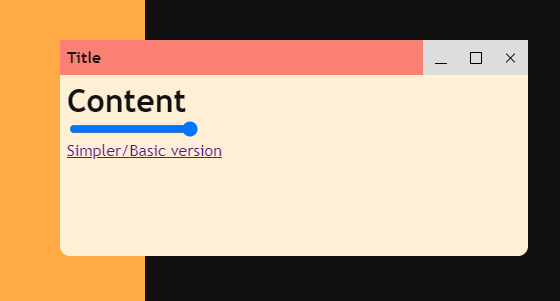

# NW.js Frameless window example

## Features:

* Custom title bar for dragging
  * Acts as a native title bar, so double-clicking will maximize and dragging to the edge of the screen works like normal
* Custom, pure CSS, window controls:
  * minimize
  * maximize
  * restore
  * close
* Transparent window with rounded corners
* Rounded corners are removed when maximized
* Adjustable background transparency
* Simplified example for easier copy/pasting
